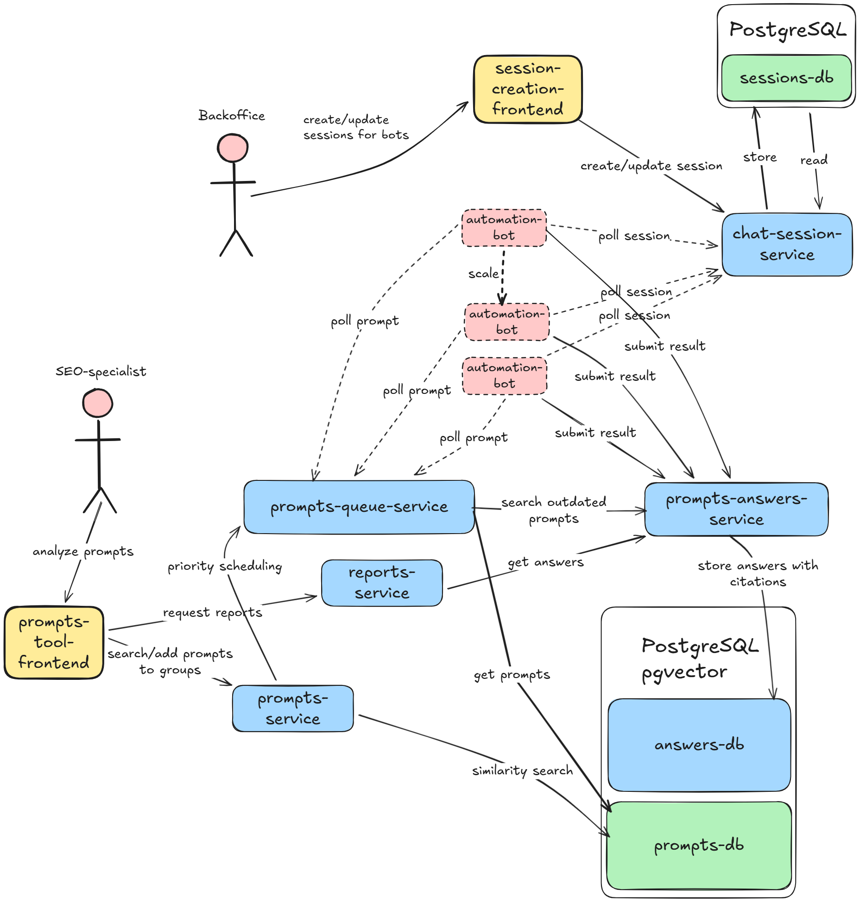

# Prompts Volume

Full-stack AI-powered prompts management platform

## Overview

**Backend:** FastAPI service for AI-powered prompt generation and management
**Frontend:** React + TypeScript web application for user authentication and prompt interaction

## Features

- User authentication (JWT-based)
- AI-powered prompt generation
- Semantic search with vector similarity in prompts database([paraphrase-multilingual-MiniLM-L12-v2 embedder supports 50+ languages](https://huggingface.co/sentence-transformers/paraphrase-multilingual-MiniLM-L12-v2))
- Prompts periodic evaluation
- Priority evaluation for prompts not from db

## Architecture



## User Flows

### 1. Search and Add Prompts to Group

Search existing prompts in the database using semantic vector search, preview matches with similarity scores, and add selected prompts to a group for tracking.

[Demo video coming soon]

### 2. Inspiration Flow - Generate Prompts from Keywords

Build prompts using DataForSEO keyword data through an ML pipeline:

1. Fetch keywords from DataForSEO API (up to 10k keywords)
2. Filter keywords (word count >= 3, brand exclusion, deduplication)
3. Generate embeddings (sentence-transformers, 384-dim multilingual model)
4. Cluster keywords semantically (HDBSCAN algorithm)
5. Filter clusters by topic relevance (cosine similarity >= 0.7)
6. Generate conversational prompts (OpenAI GPT-5.2)

[Demo video coming soon]

### 3. CSV Batch Upload

Upload a CSV file with prompts for batch processing:

- System analyzes each prompt for existing matches (similarity threshold >= 0.75)
- Review matches and choose to use existing prompts or create new ones
- New prompts are added to the evaluation queue automatically

[Demo video coming soon]

### 4. Report Generation

Generate reports for prompt groups with AI response analysis:

- Preview report cost before generating
- View brand mention analysis and visibility scores
- See citation leaderboard (top domains and pages cited in AI responses)

[Demo video coming soon]

## Quick Start

### Prerequisites

- Docker & Docker Compose
- (Optional) DataForSEO API credentials
- (Optional) OpenAI API key

### Running with Docker Compose

```bash
# 1. Configure environment
cp backend/.env.example backend/.env
# Edit backend/.env and add API keys (optional for basic auth testing)

# 2. Start all services
docker-compose up -d

# 3. Access the application
# Frontend: http://localhost:5173
# Backend API: http://localhost:8000/docs
```

**Default credentials:**
- Email: `admin@example.com`
- Password: `changethis`

### Services

| Service | Port | Description |
|---------|------|-------------|
| Frontend | 5173 | React dev server |
| Backend | 8000 | FastAPI application |
| PostgreSQL | 5432 | Database with pgvector |
| Chat-automation |    | Playwright dockerized bot for scrapping answers
## Development

### Backend Development

See [backend/README.md](backend/README.md) for detailed backend documentation:
- API endpoints reference
- Architecture & DDD structure
- ML pipeline details
- Local development setup

```bash
cd backend
uv run uvicorn src.main:app --reload
```

### Frontend Development

See [frontend/README.md](frontend/README.md) for frontend setup:
- Component structure
- Authentication flow
- Local development

```bash
cd frontend
npm install
npm run dev
```

## Technology Stack

### Frontend
- React 18 + TypeScript
- Vite (build tool)
- TanStack Router (file-based routing)
- TanStack Query (server state)
- Tailwind CSS v4

### Backend
- FastAPI (async Python)
- PostgreSQL + pgvector
- JWT authentication (bcrypt)
- sentence-transformers (embeddings)
- OpenAI API (generation)

## Project Structure

```
prompts-volume/
├── backend/              # FastAPI service
│   ├── src/
│   │   ├── auth/        # JWT authentication
│   │   ├── prompts/     # Prompt generation
│   │   ├── topics/      # Topic matching
│   │   ├── database/    # ORM models
│   │   └── ...
│   └── tests/
├── frontend/            # React application
│   ├── src/
│   │   ├── routes/      # Pages (login, signup, dashboard)
│   │   ├── hooks/       # useAuth, etc.
│   │   └── components/  # UI components
│   └── ...
└── docker-compose.yml   # Multi-service orchestration
```

## Documentation

- [Backend README](backend/README.md) - API reference, architecture, development
- [Frontend README](frontend/README.md) - UI setup, component structure
- [CLAUDE.md](CLAUDE.md) - AI assistant development guidelines
